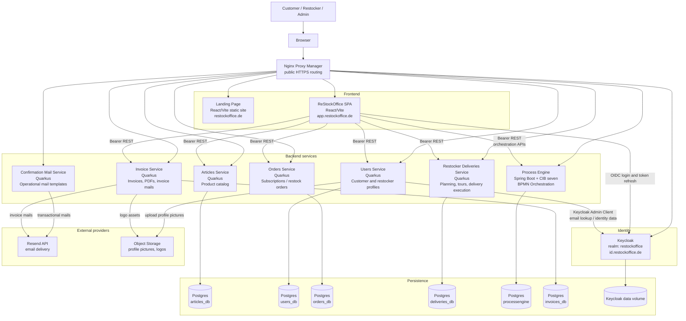
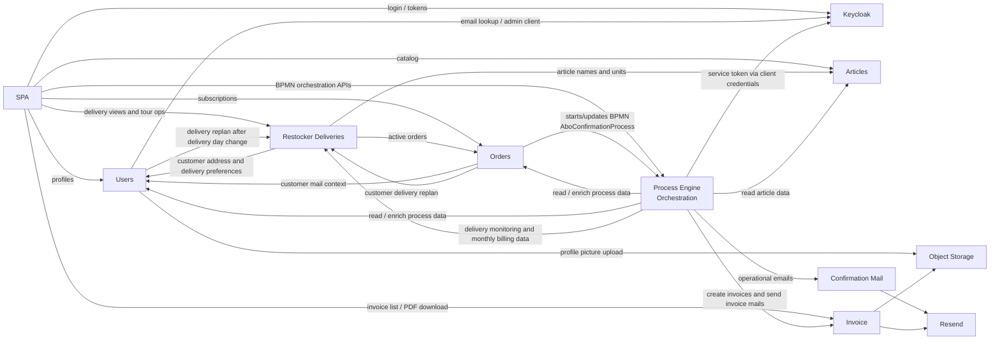
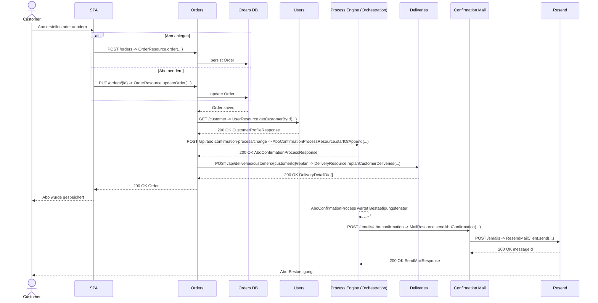
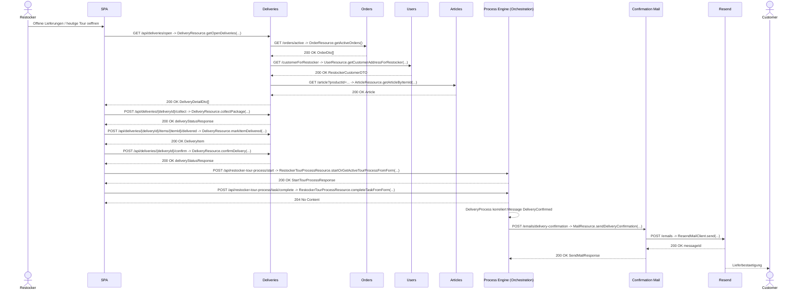
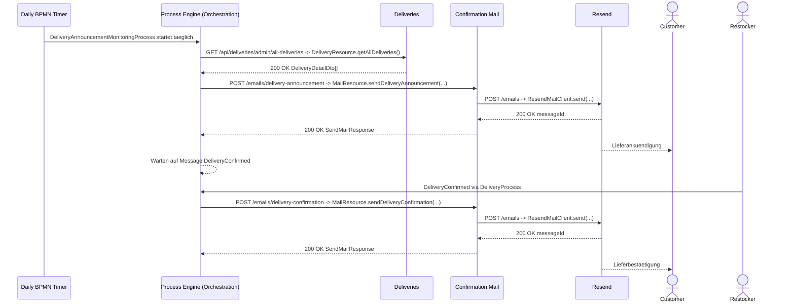
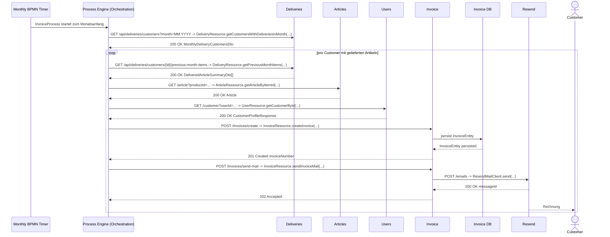
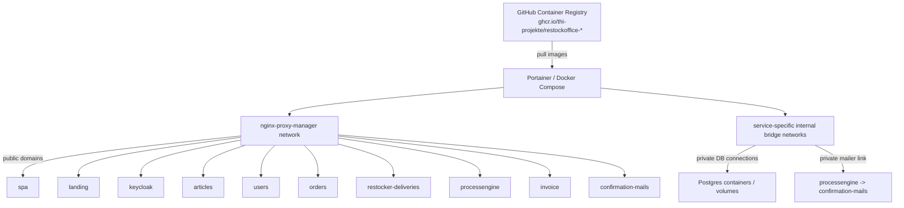

# ReStockOffice System Architecture

Stand: 2026-06-20

Diese Visualisierung basiert auf der aktuellen Repo-Struktur, den Docker-Compose-Dateien, den Service-Konfigurationen, REST-Clients und den BPMN-Prozessen im `processengine`-Modul.

## 1. Systemkontextdiagramm: Gesamtueberblick

## 2. Komponentendiagramm: Service-Abhaengigkeiten

## 3. Sequenzdiagramme: Wichtige Laufzeit-Flows

### 3.1 Sequenzdiagramm: Abo anlegen oder aendern

### 3.2 Sequenzdiagramm: Delivery-Planung und Restocker-Tour

### 3.3 Sequenzdiagramm: Lieferankuendigung und Ueberwachung

### 3.4 Sequenzdiagramm: Monatliche Rechnung

## 4. Komponenten-Inventar

| Komponente | Technologie | Hauptaufgabe | Datenhaltung / externe Systeme |
| --- | --- | --- | --- |
| `landing` | React/Vite static site | Marketing-/Public-Website | keine eigene DB |
| `spa` | React/Vite, Keycloak JS | Customer-, Restocker- und Account-UI | nutzt Backend-APIs direkt |
| `keycloak` | Keycloak 26 | Login, Realm, Rollen, Tokens | Keycloak data volume |
| `articles` | Quarkus, Hibernate ORM | Produktkatalog und Kategorien | Postgres `articles_db` |
| `users` | Quarkus, Keycloak Admin Client, S3 SDK | Customer-/Restocker-Profile, Profilbilder, Keycloak-Maildaten | Postgres `users_db`, Object Storage, Keycloak |
| `orders` | Quarkus, Hibernate ORM | Abos/RestockOrders, Abo-Aenderungen | Postgres `orders_db`, Users, Process Engine, Deliveries |
| `restocker-deliveries` | Quarkus, MicroProfile REST Client | Delivery-Planung, Touren, Annahme, Sammlung, Zustellung | Postgres `deliveries_db`, Orders, Users, Articles |
| `processengine` | Spring Boot, CIB seven | BPMN Orchestration fuer Abo-, Liefer- und Rechnungsprozesse | Postgres `processengine`, Keycloak service token, andere Services |
| `confirmation-mails` | Quarkus, Qute templates | Abo-, Lieferankuendigungs- und Lieferbestaetigungsmails | Resend API |
| `invoice` | Quarkus, PDF/e-billing, Qute templates | Rechnungserstellung, PDF-Download, Rechnungsmails | Postgres `invoices_db`, Resend API, Object Storage |

## 5. Deploymentdiagramm: Deployment-Sicht

## 6. Repo-Quellen fuer die Visualisierung

| Bereich | Wichtige Dateien |
| --- | --- |
| Deployment | `*/docker-compose.yml`, root `docker-compose.yml` |
| Backend-Konfiguration | `*/src/main/resources/application.properties`, `processengine/src/main/resources/application.yaml` |
| SPA API-Ziele | `spa/src/services/*.ts`, `spa/src/auth/keycloakConfig.ts` |
| Service-zu-Service Calls | `orders/src/main/java/de/restockoffice/OrderResource.java`, `users/src/main/java/de/restockoffice/api/UserResource.java`, `restocker-deliveries/src/main/java/de/restockoffice/**`, `processengine/src/main/java/de/restockoffice/**` |
| BPMN-Prozesse | `processengine/src/main/resources/*.bpmn` |

## 7. Hinweise und Annahmen

- `bestellungsservice` liegt noch im Repository, taucht aber in den aktuellen Compose-/Runtime-Konfigurationen nicht als produktiver Service auf und ist deshalb nicht im Hauptdiagramm enthalten.
- Die Services werden im Deployment ueber `nginx-proxy-manager` oeffentlich erreichbar gemacht. Einige Service-zu-Service-URLs zeigen in den Defaults ebenfalls auf die oeffentlichen Domains; der Mailservice wird vom Process Engine Compose zusaetzlich ueber das interne `mailer`-Netz angesprochen.
- Die Visualisierung zeigt die fachliche Laufzeitarchitektur, nicht jedes einzelne REST-Endpoint-Detail.
